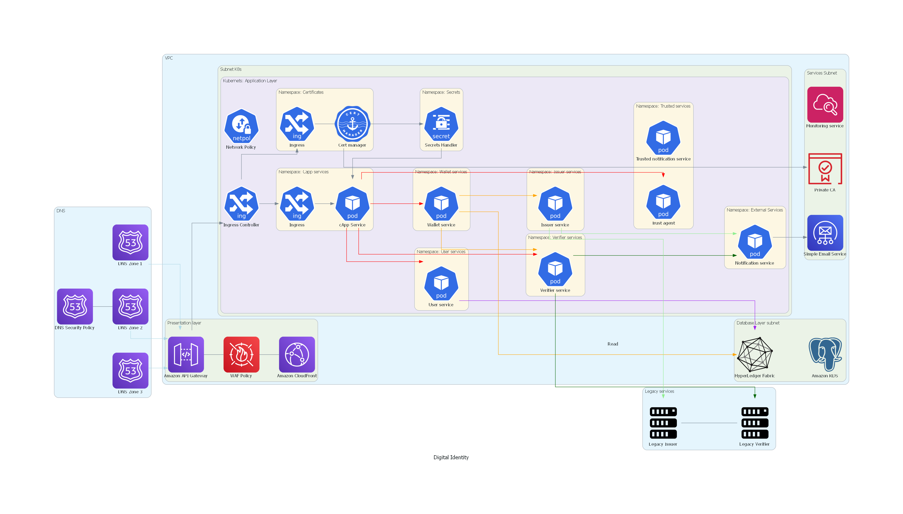

# CLOUD_SEC_T1
Tarea 1 del curso de seguridad en la nube - Maestría en Ciberseguridad 

Herramienta: Python - [Diagrams](https://diagrams.mingrammer.com)

Proposito: Desarrollo del diseño-diagrama de arquitectura Omnione OpenId para el desarrollo de un sistema de identidad digital.

Recomendación:

1 - Aislamiento de servicios.

Wallet y User service: en el diseño base del namespace waller services ns se encontraban el certified app, su servicio, el user service, el wallet service y un volumen para almacenar certificados. Este namespace estaba abierto a la conexión desde el exterior para el acceso al Capp, sin embargo, esto puede plantear problemas para otros servicios como el user service y el wallet service, que a pesar de que necesitan comunicarse con el Capp no necesitan conexión al exterior, y que al estar en el mismo namespace pueden ser susceptibles si alguno de los otros servicios del namespace se ve comprometido. Por esto mismo se recomienda aislar tanto el user service y el wallet service, y que para acceder a ellos se deba hacer mediante la definición y cumplimiento de network policies.

2 - Certificados: Esta opción es de desarrollo que de modificación. De igual manera que con los servicios explicados anteriormente, al estar en el mismo namespace del CApp se ve susceptible a actos maliciosos si algún servicio fuera vulnerado como lo pueden ser suplantación de certificados/servicios y modificaciones no deseadas. La idea es implementar un cert manager que se encargue de automatizar la gestión de certificados y que estos se almacenen en el secret de Kubernets, luego cuando sea necesario cargarlos ya sea en un volumen o como variables de entorno, esto permite añadir más regla de acceso a los certificados, detectar comportamientos extraños e incluso la automatización de actualización de los mismos cuando se detecta un cambio. Esto se debe desarrollar más, pero el utilizar este medio permite que Kubernets maneje el registro de quien accede o monta secretos, lo que facilita auditorias y seguimientos.

Factor de seguridad:

1 - Aislamiento de servicios: Manejo de privilegios, políticas y restricciones. Segmentación de la red y reducción de la superficie de ataque.
2 - Gestión de certificados: Gestión automática. Almacenamiento seguro, restricción de acceso y facilidades para auditorias, monitoreo y seguimiento.

Resultado temporal 
